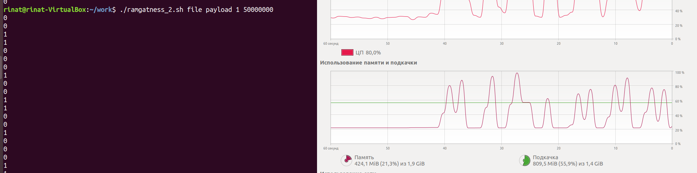

# Имя 
ramgatness_2 - скрипт, который может менять яркость или гамму изображения на экране, или нагружать оперативную память. Изменение гаммы и яркости осуществляется с помощью консольной утилиты xrandr. Нагрузка осуществляется с программы loader, написанной на c++.

# Командная строка
После названия обязательно прописываются четыре команды: что будет делать скрипт (payload,gamma,brightness), положение файла, сколько будет длиться обработка нулей(в секундах) и на сколько байтов нагружать оперативную память.

./ramgatness_2.sh file_location action time size_byte

# Пример
./ramgatness_2.sh ../file payload 4 50000000
./ramgatness.sh ../../home/file gamma 3

